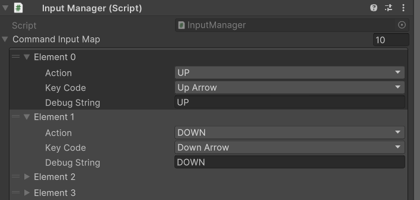
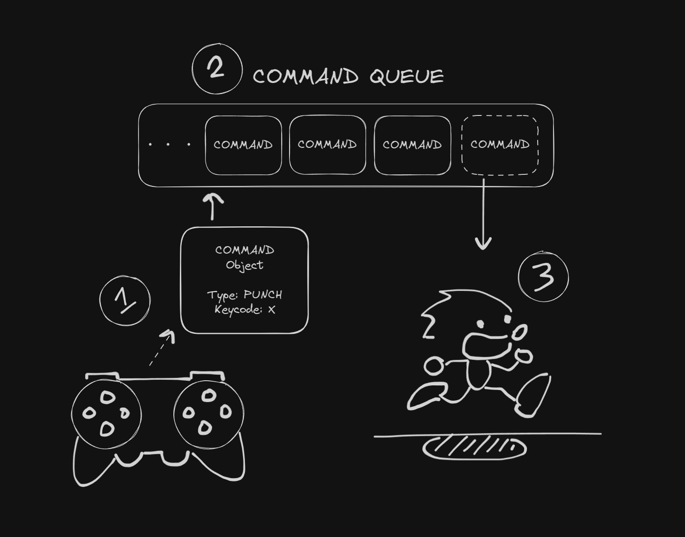

# Fighting Game Template using the Command Pattern

This is an educational resource to explain the "Command Pattern" and it's usefulness in game development.

Note that this resource is created to be pedagogical in nature and not for production, so optimization and other improvements that could still be made are outside the scope of this Unity project.

## Getting started

Here are the controls for "SampleScene". They can be remapped in the InputManager component of the GameManager game object.

- `LEFT/RIGHT`: Moving left and right
- `SPACE`: Jump
- `Z`: Hold to run
- `X`: Punch. Also executes chained punches with consecutive presses
- `DOWN + RIGHT/LEFT + X`: "Hadouken" / Fireball attack
- `Q`: Create an instant copy of Jammo that replays your last sequence of moves
- `W`: Write all recorded player inputs into a .txt "Replay" file

If you run the scene with `GameManager.PlayReplayFile = true` (assignable from the scene's Inspector), the game will read all recorded inputs in "Replay.txt" and play them automatically.

## Explaining the Command Pattern

The purpose of the Command pattern is to encapsulate a request (in our case, a user input) as an object, thereby allowing it to be passed as a parameter to other objects (in our case, a character controller). These "Command" objects can also stored as part of a collection for delayed/scheduled execution, in what is known as "input buffering".

This setup enables the InputManager to remain unaware of the implementation details of the character controller and vice-versa, hence achieving loose coupling. It also allows us to easily extend our game with cool features, such as instant replays or to create chained actions/combos.

## "no-replays" branch

As mentioned, one of the biggest advantages of the Command Pattern is the decoupling of the "requestor" (i.e. InputManager) from the "executor" (i.e. "PlayerController").

To fully showcase the simplicity of such an implementation, you may go to the "no-replays" branch which removes the implementation of "saved replays" and "instant replays". 

## Credits

- Developer: Tan Kang Soon, 2023
- Character Model: "Jammo" from "Mix and Jam"
- Animations: "Mixamo" from Adobe
- Particle Effects: "Particle Pack" from Unity Technologies
